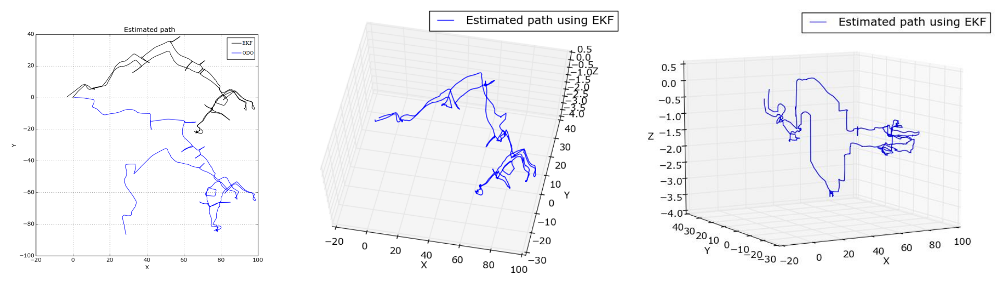

## 3D Pose Estimation of the Planar Robot Using Extended Kalman Filter

### Introduction
This project focuses on the navigation and path estimation of a 2D planar robot (tank-
threaded robot), in 3D space. The project refers to the classical dead reckoning problem, where
there is no accurate information available about the position of the robot and the robot is not
equipped with a GPS sensor, the only provided information is the change in position and orientation
over time (Odometry , which is not robust against drifting), and a more accurate
orientation of the robot provided by IMU device. The aim here, is to use those data coming from
the Odometry and IMU devices to design an extended kalman filter in order to estimate the position
and the orientation of the robot. The position of the 2D planar robot has been assumed to be 3D,
then the kalman filter can also estimate the robot path when the surface is not totally flat. One may
also use the linear acceleration and angular velocity provided by IMU, but in this project they are
skipped because of the high noise and the sudden changes in the information caused by a bumpy
road or other elements.

### Demonstration
The results of the default sample are illustrated in the following figure. On the left, you can see the comparison between the odometric path estimation and EKF. The rest of the figures show the 3D path estimated using EKF. The starting and ending point of the actual path traversed by the robot is the same, but in the odometric estimation, there is a big displacement between these two points. After correcting the angles using the extended kalman filter, the displacement significantly decreased. 

### Adviser 
Prof. Giorgio Grisetti

### Code

Please make sure you have the the following requirements installed:
> Requirements
>- Python >= 3.6  
>- RosBag (sudo apt-get install python-rosbag) 
>- NumPy  
>- MatplotLib 

To run the code, set your parameters in `main.py` file, then run `python main.py`.
